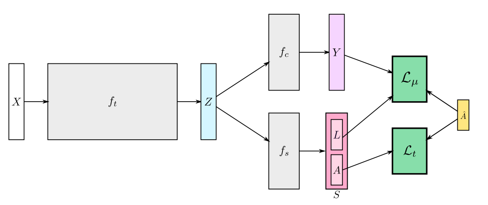

# MuCon



Official implementation of [Fast Weakly Supervised Action Segmentation Using Mutual Consitency](https://arxiv.org/abs/1904.03116).

```
@article{mucon2021,
    Author    = {Souri, Yaser and Fayyaz, Mohsen and Minciullo, Luca and Francesca, Gianpiero and Gall, Juergen},
    Title     = {{Fast Weakly Supervised Action Segmentation Using Mutual Consistency}},
    Journal = {{PAMI}},
    Year      = {2021}
}
```

## General Information

The code-base is built using the [fandak](https://github.com/yassersouri/fandak) library.

## Dataset

### Breakfast

**Step 1**

Downloading Breakfast dataset with I3D features: https://zenodo.org/record/5179904

Everything needed is included in `breakfast_i3d.zip` file.

**Step 2**

Create a directory at `~/work/MuCon`. If you don't have enough space at your home directory (`~`) then use a symlink.

Then do the following:

```bash
cd ~/work/MuCon
mkdir datasets
cd datasets
mv /path/to/downloaded/breakfast_i3d.zip ./
unzip breakfast_i3d.zip
rm breakfast_i3d.zip # optionally, if you don't need it.
```

## MuCon

**Step 1: Create the root directory**

```bash
cd ~/work/MuCon
mkdir root
```

Intermediate results, models, tensorboard logs, etc. will be saved in this directory. If you don't have enough space at `~` create a symlink.

**Step 2: Copy the repo**

Docker and Nvidia-Docker is the most important requirements. All other requirements will be installed automatically inside docker.

```bash
cd ~/repo  # or any other location you wish.
git clone https://github.com/yassersouri/MuCon.git
cd MuCon
```

**Step 3: Build the docker image**

```bash
cd docker/pytorch1.1
./build.sh
```

**Step 4: Run the experiment**

Using the below code you can run the default training and testing on split 1 of the breakfast dataset.
_Note_: You have to set the `CUDA_VISIBLE_DEVICES` environment variable.
```bash
cd ~/repo/MuCon
export CUDA_VISIBLE_DEVICES=0
./run-docker-pytorch1.1.sh python src/train_test_mucon.py --cfg src/configs/docker/inside.yaml --set dataset.split 1
```

At the end of the program it will output the results of training, which looks like something like this:

```
MuConEvaluatorResult(y_mof=0.4374427438716199, y_mof_nbg=0.4255722067659505, y_iod=0.724194675038116, y_iou=0.39804877235464414, s_mof=0.441788286580743, s_mof_nbg=0.4227709493882079, s_iod=0.4809540489892753, s_iou=0.3644463243702167, s_iod_nbg=0.4265855312320258, s_iou_nbg=0.31716805755780547, s_mat_score=0.7588650138682775, s_len_diff=1.3214285714285714, vit_mof=0.47972540750568615, vit_mof_nbg=0.46599277794190475, vit_iod=0.5163879039088691, vit_iou=0.39922937940944814, vit_iod_nbg=0.46699351233834946, vit_iou_nbg=0.35887711811445244)
```

Here you can see various metric. The main metric of interest is "vit_mof".
